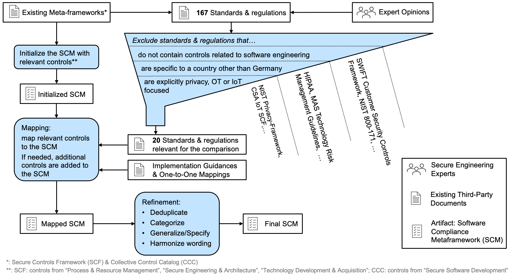

# Software Compliance Meta-Framework

This repository contains the Software Compliance Meta-Framework (SCM) which was developed as part of a master's thesis by Nico Fechtner at the [Chair of Software Engineering for Business Information Systems](https://wwwmatthes.in.tum.de/pages/t5ma0jrv6q7k/sebis-Public-Website-Home) at [Technical University of Munich](https://www.tum.de/en/).

## Motivation

The meta-framework provides a structured mapping of security standards, regulations, and maturity models that contain requirements relevant to software engineering.
On the one hand, this lays the foundation for the further research we conducted on achieving security compliance in agile devlopment contexts.
On the other hand, the meta-framework can be leveraged, for example, by organizations having to comply with multiple standards or regulations simultaneously or by organizations performing a gap analysis to evaluate if they should adopt an additional standard.

## Related Work

There are existing projects working on extensive standard mappings, namely the [SCF](https://www.securecontrolsframework.com) covering 175 standards and regulations and the [CCC](https://www.auditscripts.com/?attachment\_id=4609) covering 35 standards and regulations.
While these can, in principle, be leveraged for a comparison of more than a few standards, software-specific and industry-specific German standards and regulations are missing.
Additionally, there is no measure of how exact specific mappings are, meaning that there is no means of differentiation between controls that are fully or only partially mappable to a particular requirement.
This leads to high variability of the mapping quality.
While existing meta-frameworks are not sufficient for our research objective, we use them in the development of the SCM both for the initialization with common secure engineering-related controls and for quality assurance purposes.

## Methodology

The general approach we leveraged is depicted in the following figure.

### Document selection

First, we identified relevant documents, i.e., security standards, regulations, and maturity models.
To get a reasonable set of potentially relevant documents, we considered all documents included in the SCF and CCC meta-frameworks.
In addition, we performed an informal Google search and spoke with industry experts working at the intersection of agile development and security compliance to gather additional standards that are relevant to (German) practitioners but may not be included in the existing meta-framework.

We then applied the filtering criteria outlined in the figure above.
In general, we always selected the most recent version of a document.
Since they are not relevant to our research objective, we disregard all documents not containing software engineering-related controls.
For example, the SWIFT Customer Security Controls Framework does contain security controls applicable to all international banks.
Hhowever, it does not include requirements specific to software engineering.
To keep the scope reasonable for the thesis, we also did not consider documents specific to a country other than Germany.
A case in point: the HIPAA does contain software engineering-related controls.
However, it is only applicable to the United States healthcare industry.
Furthermore, we excluded documents that focus on privacy aspects.
Even though privacy and security are two closely related topics, we focused solely on the security aspects of software development.
With this reasoning, we excluded, for example, the NIST Privacy Framework.
To reduce the scope further and make the document comparison results transferable to as many industries as possible, we disregarded documents focussing on low-level software development for OT or IoT contexts.
Therefore, e.g., the CSA IoT Security Controls Framework was excluded.

### SCM Initialization

The goal of the SCM is to map common security controls to specific controls required by the standards, regulations, and maturity models identified above.
It is only intended to cover controls regarding software engineering and explicitly does not cover requirements related to secure coding.
To initialize the SCM with relevant controls, we selected software engineering-related controls from the existing meta-frameworks. In the SCM these could be found in the domains *Process & Resource Management*, *Secure Engineering & Architecture*, and *Technology Development & Acquisition* while in the CCC, the only category containing relevant controls was *Secure Software Development*.

### Mapping

Based on the initialized SCM, the mapping of the documents identified above is performed.
For each document, the following procedure is performed.
In general, each control is analyzed.
If a control relates to software engineering, we consider it for the mapping procedure.
If there is already a SCM control that covers the intention of the control in the document, it is mapped.
That means that the reference to the control in the standard, regulation, or maturity model together with an indication of the exactness-level.
A mapping can be *exact*, meaning that the wording might differ, but the intention and the degree of detail are the same.
Furthermore, it can be *overspecific*, meaning that the SCM control describes the topic more precisely than the control in the document to be mapped.
In addition, a mapping can be *underspecific*, meaning that the SCM control describes the topic more generally than the control in the document to be mapped.
Lastly, there is also the possibility that a mapping is not possible.
Keeping track of this level of exactness is vital for the refinement, as described below.
For quality assurance of the mappings, we considered the mappings included in the existing meta-frameworks and one-to-one mappings, which are available for many documents.
For example, one of the first documents we mapped was ISO/IEC 27002, one of the most recognized security standards globally across many different sectors.
For many of the documents we mapped afterward, there was a one-to-one mapping against ISO/IEC 27002 available.
On the one hand, we were able to check if there might be some controls in the SCM that are mapped against ISO/IEC 27002, and there exists a mapping of that ISO control to the document control, but we did not yet map it to an SCM control.
On the other hand, we could check if there are controls that were newly added to the SCM that have an ISO/IEC 27002 mapping which can be added to the SCM.
Whenever a control cannot be mapped to an existing SCM control, it is added to the SCM as a new control.

### Refinements

After all documents were mapped, we further refined the SCM.
First, duplicate controls were merged.
In theory, it should not be possible to have two controls with the same intent since, in this case, no new control should have been added to the SCM, but the document control should instead have been mapped to the existing SCM control.
In practice, however, it might be the case that due to the relatively large amount of SCM controls duplicates appear even if they do not cover the same level of detail.

Furthermore, the controls were sorted into categories to make the SCM easier to grasp.
The categorization is, in principle, based on OWASP SAMM.
In addition to the security practices defined by SAMM, we added the following five additional ones since there were controls in the SCM that did not fit well in the native SAMM security functions: *Stakeholder Communication*, *Change Management*, *Development Environment*, *Documentation*, and *Roles and Responsibilities*.
Furthermore, we renamed the SAMM security function *Defect Management* to *Vulnerability Management* since this wording was used much more often in the analyzed documents.

An additional refinement was to tune the specificity of the SCM controls to maximize the number of exact mappings and minimize the number of fuzzy, i.e., over- or underspecific, mappings that are already mapped to more suitable controls.
For this, we leveraged the exactness level of the document mappings. If, for example, a SCM control is mapped often with the note *overspecific}, it might make sense to generalize the SCM control a bit so that it maps more closely to the actual requirements of the standards, regulations, and maturity models.
It can also be the case that it makes sense to remove a SCM control if it contains, for example, solely overspecific mappings to requirements that are already mapped to other SCM controls.
As a heuristic, we analyzed all SCM controls that did not have exact mappings but cantained either only overspecific or solely underspecific mappings.
A case in point:  the untuned version of the SCM contained a control requiring to "limit privileges to change software resident within software libraries." This originated from the initialization phase.
However, all mappings referred to controls about general change management procedures.
Since these were already mapped to an according SCM control, we could remove the SCM control covering changes to software libraries and therefore get rid of four overspecific mappings.

Last but not least, we harmonized the wording amongst the SCM controls to make them more readable and consistent.
For example, since the terms *weakness*, *flaw*, and *defect* are typically used interchangeably in practice to describe a security issue in the specification, development, or configuration of software, we harmonized them to *defect* in the SCM, following the OWASP SAMM terminology of security practices.